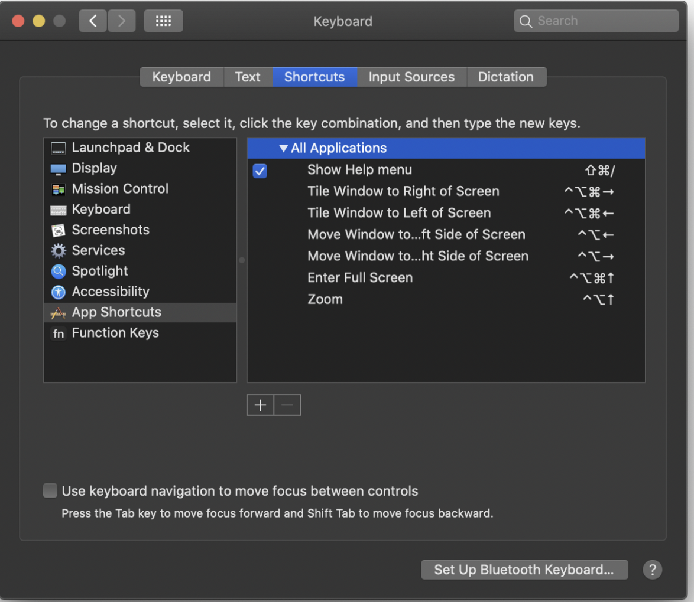
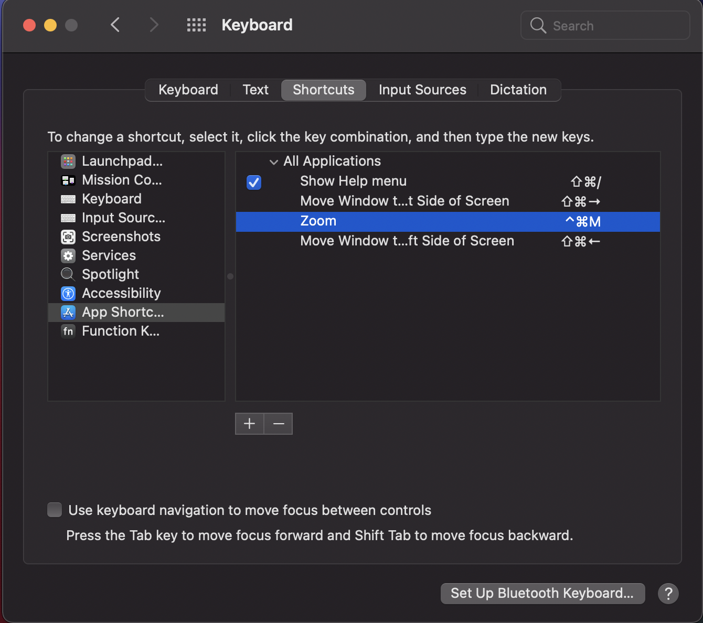

# General

## Change screenshots location

```sh
defaults write com.apple.screencapture location /Users/$(whoami)/Documents/Screenshots
# or change type of file
defaults write com.apple.screencapture type jpg [pdf|tiff|gif]
```

## Change screenshots first part of name

```sh
defaults write com.apple.screencapture name "OSXDaily"
killall SystemUIServer
```

## Move window to left or right by configured shortcut

You can do it opening keyboard settings:

Go to `System Preferences → Keyboard → Shortcuts → App Shortcuts` and type text:

- `Move Window to Left Side of Screen`
- `Move Window to Right Side of Screen`





## Archive zip file/folder with password

```sh
zip -er example.zip ./example-folder/*
```

## Show/hide hidden files

```sh
defaults write com.apple.finder AppleShowAllFiles YES; //or NO
killall Finder
```

> You can also use keyboard shortcut `Shift + Command + .`

## Delete all .DS_Store files

```sh
sudo find / -name .DS_Store -delete; killall Finder
```

## How to check if port is open

```sh
# if ssh is open
nc -zv rpi-homer.lan 22
```

# How to create curl get/post methods

```sh
# GET basic request
curl http://localhost:3001/

# POST request
curl -X POST -H 'Content-Type: application/json' -d '{
  "title": "Pizza",
  "price": 10.5
}' http://localhost:3001/

# UPDATE requets
ID=${AD_ID}
curl -X PUT -H 'Content-Type: application/json' -d '{
  "price": 12.5
}' http://localhost:3001/$ID

# DELETE request
curl -X DELETE http://localhost:3001/$ID
```
